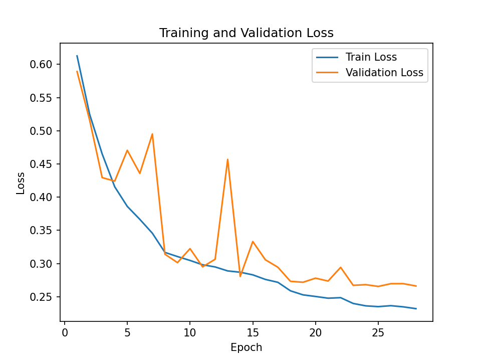
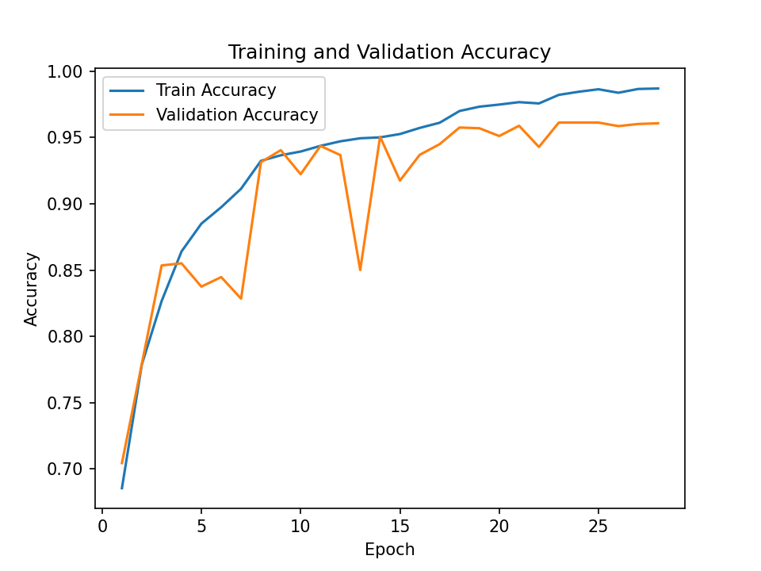

# CatDog_classification

基于 **PyTorch + BatchNorm 卷积网络** 的猫狗二分类图像识别项目，从自定义 `Dataset`、`DataLoader` 开始，完整实现数据预处理、数据增强、模型训练、Early Stopping、测试评估、混淆矩阵分析、单张图片预测与多卡并行训练。

---

## 一、最新训练结果（2026-09-08）

本次使用 **3 × NVIDIA GeForce GTX 1080 Ti 并行训练**，并引入 **Label Smoothing、Momentum、Weight Decay**：

| 指标 | 结果 |
|---|---:|
| 实际训练轮数 | 28（触发 Early Stopping） |
| 最佳验证集 Epoch | 23 |
| 最佳验证集准确率 | **96.13%** |
| 最后一轮训练集准确率 | 98.70% |
| 最后一轮验证集准确率 | 96.08% |
| 测试集 Loss | **0.1326** |
| 测试集准确率 | **95.734%** |





测试集混淆矩阵：

```text
[[1800   88]
 [  72 1791]]
```

说明：

- 真实猫 1888 张，其中 1800 张预测正确，88 张被误判为狗；
- 真实狗 1863 张，其中 1791 张预测正确，72 张被误判为猫。

---

## 二、数据集

使用猫狗二分类数据集：

```text
图片总数（过滤损坏后）：24998 张
Cat：约 12500 张，标签 0
Dog：约 12500 张，标签 1
```

数据集划分：

| 数据集 | 数量 | 比例 |
|---|---:|---:|
| 训练集 | 17498 | 70% |
| 验证集 | 3749 | 15% |
| 测试集 | 3751 | 15% |

数据路径在 `config.py` 的 `root_dir` 中配置，可指向本地或服务器上的 `PetImages` 目录。

---

## 三、项目结构

```text
CatDog_classification/
│
├── CatDog_dataset/        # 数据集（默认不上传 GitHub）
│
├── config.py              # 数据路径与训练参数
├── dataset.py             # 自定义 Dataset / DataLoader / 数据增强
├── model.py               # VGG 风格卷积网络 + BatchNorm
├── train.py               # 单卡训练
├── train_multi_gpu.py     # 三卡 DataParallel 并行训练
├── test.py                # 测试集评估 + 混淆矩阵
├── predict.py             # 单张图片预测
├── plot_save.py           # 将训练曲线保存为 PNG
├── check_batchnorm.py     # BatchNorm 相关检查
│
├── loss_curve.png         # 训练 / 验证 Loss 曲线
├── accuracy_curve.png     # 训练 / 验证 Accuracy 曲线
├── vgg16_bn_best.pth      # 最佳模型权重（默认不上传 GitHub）
├── README.md
└── .gitignore
```

---

## 四、模型结构

模型为 VGG 风格的卷积网络，全部层由自己搭建，不使用预训练权重：

```text
输入 128 × 128 × 3
    ↓
Block1：Conv64 + BN + ReLU → Conv64 + BN + ReLU → MaxPool
    ↓
Block2：Conv128 + BN + ReLU → Conv128 + BN + ReLU → MaxPool
    ↓
Block3：Conv256 + BN + ReLU → Conv256 + BN + ReLU → MaxPool
    ↓
Block4：Conv512 + BN + ReLU → Conv512 + BN + ReLU → MaxPool
    ↓
Block5：Conv512 + BN + ReLU → Conv512 + BN + ReLU → MaxPool
    ↓
AdaptiveAvgPool(1 × 1)
    ↓
FC：512 → 128 → 2
```

特点：

- 每个卷积层后接 BatchNorm 与 ReLU；
- 分类器中使用 Dropout(0.5) 抑制过拟合；
- 最终通过 `AdaptiveAvgPool` 将特征压缩到 1×1，再进入全连接层。

---

## 五、训练配置

| 配置项 | 当前设置 |
|---|---|
| 输入尺寸 | 128 × 128 |
| Batch Size | 64 |
| 最大 Epoch | 50 |
| Early Stopping patience | 5 |
| 优化器 | SGD |
| 初始学习率 | 0.001 |
| Momentum | 0.9 |
| Weight Decay | 5e-4 |
| 损失函数 | CrossEntropyLoss(label_smoothing=0.1) |
| 学习率调度 | ReduceLROnPlateau(patience=2, factor=0.5) |
| 训练方式 | DataParallel，三卡并行 |
| 数据加载 | num_workers=8 |

数据增强：

```text
Resize(128, 128)
RandomHorizontalFlip
RandomRotation(10)
ToTensor
Normalize(mean=0.5, std=0.5)
```

---

## 六、实验结果分析

本次训练实际运行 28 轮后触发 Early Stopping，最佳验证集结果出现在第 23 轮：

| 阶段 | 结果 |
|---|---:|
| 最佳验证集准确率 | 96.13%（第 23 轮） |
| 最后一轮验证集准确率 | 96.08% |
| 测试集准确率 | 95.734% |

从曲线可以看出：

- 训练 Loss 与验证 Loss 同步下降，未出现严重过拟合；
- 训练集准确率约 98.70%，验证集约 96.08%，测试集 95.734%，三者差距较小；
- 引入 Label Smoothing、Weight Decay 后，模型对验证集的泛化能力明显提升。

---

## 七、运行方法

### 1. 准备环境

```bash
conda create -n pytorch python=3.10 -y
conda activate pytorch
pip install torch torchvision torchaudio --index-url https://download.pytorch.org/whl/cu118
pip install numpy pillow matplotlib -i https://mirrors.tuna.tsinghua.edu.cn/pypi/web/simple
```

### 2. 修改数据路径

打开 `config.py`，将 `root_dir` 改为本机 `PetImages` 所在目录：

```python
root_dir = "/你的路径/PetImages"
```

### 3. 训练

单卡训练：

```bash
python train.py
```

三卡并行训练：

```bash
python train_multi_gpu.py
```

建议使用 screen 防止断线：

```bash
screen -S catdog
conda activate pytorch
python -u train_multi_gpu.py
```

### 4. 生成曲线

```bash
python plot_save.py
```

会在当前目录生成 `loss_curve.png` 与 `accuracy_curve.png`。

### 5. 测试与预测

```bash
python test.py
python predict.py
```

---

## 八、运行环境

| 项目 | 版本 / 配置 |
|---|---|
| 操作系统 | Ubuntu 20.04 |
| Python | 3.10.21 |
| PyTorch | 2.7.1+cu118 |
| CUDA Driver | 535.309.01（CUDA 12.2） |
| GPU | 3 × NVIDIA GeForce GTX 1080 Ti（11GB） |
| 并行方式 | DataParallel |
| 版本管理 | Git + GitHub |

---

## 九、后续优化方向

1. 尝试使用预训练 ResNet / EfficientNet 做迁移学习；
2. 进一步提高输入分辨率（如 224 × 224）；
3. 加入更强的数据增强（RandomResizedCrop、ColorJitter、Random Erasing）；
4. 尝试更大的 Batch Size 或动态调整学习率；
5. 使用 DDP 多进程训练，追求接近线性的多卡加速；
6. 将模型部署为简单的 Web 图片分类应用。

---

## 十、总结

通过该项目完整实践了图像分类任务的数据读取、数据增强、模型搭建、多卡训练、Early Stopping、模型保存、测试评估与结果可视化。当前模型在测试集上达到 **95.734%** 准确率，验证集准确率达到 **96.13%**。
